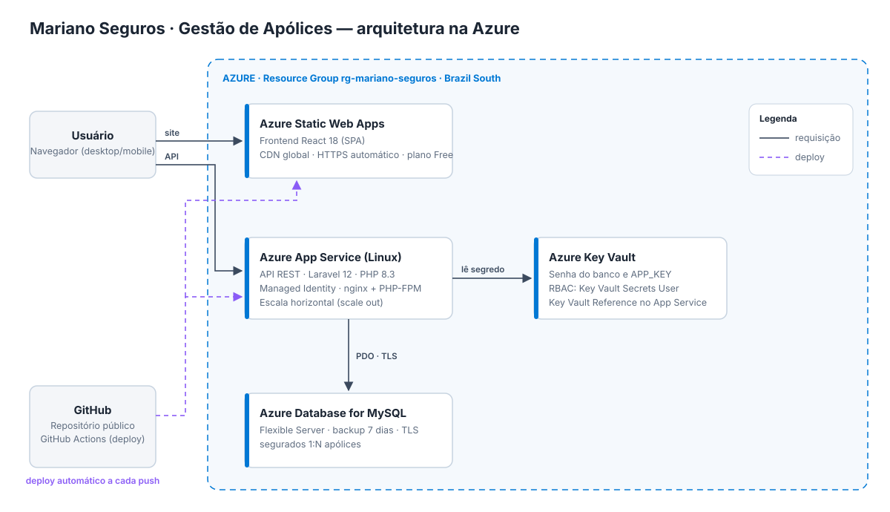
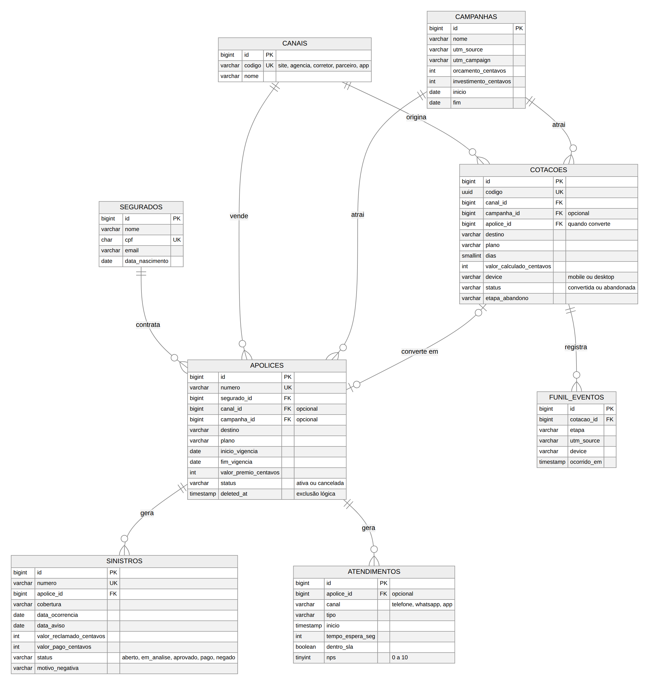

# Coris Seguros - Gestão de Apólices de Seguro Viagem

Seguro Viagem é uma aplicação web para **gestão de apólices de seguro viagem**, desenvolvida como teste técnico, utilizando **Laravel 12**, **React 18** e **MySQL**, com desenho de solução na **Azure**. O foco foi entregar o CRUD completo com regras reais do negócio de seguros (cálculo do prêmio, vigência, exclusão lógica), código organizado seguindo **SOLID** e **Clean Code** e testes automatizados.

---

## Requisitos atendidos

- Leitura, cadastro, edição e exclusão de apólices
- **Dashboard** com indicadores de vendas, marketing, sinistros e atendimento
- Conceitos de **SOLID** e **Clean Code** (veja [onde cada um aparece](#onde-estão-o-solid-e-o-clean-code))
- Frontend em **React 18**
- Banco de dados relacional (**MySQL**) com relacionamentos **1:N** ([diagrama](#modelagem-do-domínio))
- Desenho de solução com componentes da **Azure** (publicação pendente)
- Testes automatizados (PHPUnit)
- Docker para desenvolvimento local

---

## Tecnologias

- **Backend:** Laravel 12 (PHP 8.3)
- **Frontend:** React 18 + Vite + React Router + Recharts (gráficos)
- **Banco:** MySQL 8 (SQLite para rodar local sem instalar banco)
- **Testes:** PHPUnit
- **Docker:** Apache + PHP, MySQL e Nginx servindo o React
- **Azure:** App Service, Static Web Apps, Database for MySQL e Key Vault

---

## Desenho da solução



- **Static Web Apps** hospeda o React (estático, em CDN, com HTTPS)
- **App Service (Linux)** roda a API Laravel
- **Azure Database for MySQL** guarda segurados e apólices
- **Key Vault** guarda a senha do banco e a `APP_KEY`, lidas pelo App Service com **Managed Identity**
- **GitHub Actions** faz o deploy a cada push (workflow `.github/workflows/azure-api.yml`)

---

## Modelagem do Domínio



- **Segurado** → possui muitas **Apólices** (1:N). É identificado pelo CPF e reaproveitado entre apólices
- **Apólice** → pertence a um **Segurado**, tem destino, plano, vigência, prêmio e status (ativa ou cancelada)

Tabelas que alimentam a dashboard (criadas em migrations novas, sem alterar as antigas):

- **Canais** (site, agências, corretores, parceiros, app) e **Campanhas** de marketing (UTM, orçamento e investimento) → a apólice passa a guardar o canal e a campanha da venda
- **Cotações** → toda simulação de preço, convertida em apólice ou abandonada (e em qual etapa)
- **Eventos do funil** → um registro por etapa que o cliente passou (iniciada → preço calculado → dados → pagamento → emitida)
- **Sinistros** → pertencem a uma apólice, com cobertura acionada, valor reclamado, valor pago e status
- **Atendimentos** → contatos com a central 24h (canal, tempo de espera, SLA e nota NPS)

O diagrama também está em [`docs/der.svg`](docs/der.svg) e, em Mermaid, em [`docs/modelo-de-dados.md`](docs/modelo-de-dados.md).

---

## Regras de negócio

- **Prêmio** = diária do plano × dias de viagem × % do destino × % da idade do segurado
  - Planos: Essencial (R$ 12,90/dia), Plus (R$ 24,90/dia), Premium (R$ 39,90/dia)
  - Destino: Nacional 50%, América do Sul 100%, Europa 130%, América do Norte 140%, Ásia/África/Oceania 150%
  - Idade no início da viagem: até 59 anos 100%, 60 a 74 anos 160%, 75+ anos 250%
- Valores em dinheiro são guardados em **centavos (inteiro)**, nunca em `float`, para não ter erro de arredondamento
- A vigência não pode começar antes de hoje e tem no máximo 365 dias
- CPF validado pelos dígitos verificadores
- Apólice cancelada só pode ser alterada para ser reativada
- A exclusão é **lógica** (`SoftDeletes`): a apólice some do sistema, mas o registro fica no banco

---

## Fluxo

1. Operador cadastra uma **Apólice**.
   - O prêmio é calculado em tempo real enquanto o formulário é preenchido (endpoint de cotação).
   - Se o CPF já existir, o **Segurado** é reaproveitado.
2. Consulta a lista com busca (nome, CPF, e-mail ou número), filtro por status e paginação.
3. Edita a apólice e o prêmio é recalculado.
4. Cancela ou reativa pelo status.
5. Exclui a apólice (exclusão lógica).

---

## Dashboard

Tela **Dashboard** com filtro de período (30 dias, 90 dias, 12 meses e 24 meses) e quatro visões. O período e a visão ficam na URL, então dá para compartilhar o link.

- **Visão geral** (diretoria): prêmio emitido, apólices, ticket médio, conversão, sinistralidade e NPS, cada um comparado com o período anterior; prêmio mês a mês contra o ano anterior (6 ou 12 meses, linha ou colunas)
- **Marketing** (a campanha converte e o investimento volta?): cotações, conversão, investimento, prêmio gerado, ROI e custo por apólice; funil de conversão com a etapa de maior abandono; conversão por canal; **campanha em detalhe**, escolhida numa lista, com gráfico semanal de cotações e apólices; comparativo das campanhas; antecedência da compra
- **Comercial** (quanto vendemos): prêmio emitido, apólices, ticket médio e cancelamentos comparados com o período anterior; vendas e participação por canal; vendas por destino; mix de planos e ticket médio por plano
- **Sinistros e atendimento:** frequência, custo médio, sinistralidade por destino (meta de 60%), custo por cobertura, NPS e SLA da central

As fórmulas ficam em um lugar só (`app/Services/Dashboard/Metricas.php`):

| Métrica | Fórmula |
|---|---|
| Ticket médio | prêmio emitido ÷ apólices |
| Conversão | cotações convertidas ÷ cotações |
| Prêmio ganho | prêmio × (dias de viagem dentro do período ÷ dias da viagem) |
| Sinistralidade | custo dos sinistros ÷ prêmio ganho |
| Frequência | sinistros avisados ÷ apólices emitidas |
| Custo médio (severidade) | custo dos sinistros ÷ quantidade de sinistros |
| Taxa de negativa | sinistros negados ÷ sinistros finalizados |
| ROI da campanha | (prêmio gerado − investimento) ÷ investimento |
| Custo por apólice | investimento da campanha ÷ apólices vendidas por ela |
| Participação do canal | prêmio do canal ÷ prêmio total |
| NPS | % de promotores (nota 9–10) − % de detratores (nota 0–6) |

O **custo do sinistro** é o valor pago quando já foi pago, zero quando foi negado e o valor reclamado enquanto ainda está em aberto.

**Dados de demonstração:** o `DashboardSeeder` gera 24 meses de histórico (cerca de 2.800 apólices, 12.800 cotações, 180 sinistros e 1.800 atendimentos) com sazonalidade (julho, dezembro e janeiro mais fortes), crescimento de 12% ao ano, campanhas sazonais e conversão menor no celular. Usa semente fixa, então os números são sempre os mesmos.

---

## Organização do backend

```
routes/api.php                  rotas da API
app/Http/Requests               validação (SalvarApoliceRequest, CotacaoRequest) e regra de CPF
app/Http/Controllers/Api        recebe a requisição e chama o service
app/Services/ApoliceService     regras de negócio (criar, atualizar, excluir, cotar, resumo)
app/Services/Premio             CalculadoraPremio (interface) e CalculadoraPremioViagem
app/Services/Dashboard          DashboardService (monta cada visão), Metricas (fórmulas) e Periodo (filtro)
database/seeders                DashboardSeeder (histórico de 24 meses) e exemplos
app/Models                      Segurado e Apolice (Eloquent)
app/Enums                       Plano, Destino e StatusApolice
app/Http/Resources              formato do JSON de resposta
```

---

## Onde estão o SOLID e o Clean Code

| Princípio | Onde aparece no código |
|---|---|
| **S** - Responsabilidade única | `SalvarApoliceRequest` só valida, `ApoliceController` só trata o HTTP, `ApoliceService` só aplica a regra, `CalculadoraPremioViagem` só calcula e `ApoliceResource` só formata o JSON. Na dashboard: `DashboardController`, `DashboardService`, `Metricas` e `Periodo` |
| **O** - Aberto/fechado | Nova regra de preço = nova classe que implementa `CalculadoraPremio`, sem mexer no `ApoliceService`. Novo plano ou destino = novo `case` em `app/Enums` |
| **L** - Substituição de Liskov | Qualquer implementação de `CalculadoraPremio` substitui a `CalculadoraPremioViagem`; o service só conhece o contrato |
| **I** - Segregação de interfaces | `CalculadoraPremio` tem um único método, `calcular` |
| **D** - Inversão de dependência | O construtor do `ApoliceService` recebe a interface; o `AppServiceProvider` decide a implementação |

```php
// app/Services/ApoliceService.php: depende da interface
public function __construct(private readonly CalculadoraPremio $calculadora) {}

// app/Providers/AppServiceProvider.php: escolhe a implementação
$this->app->bind(CalculadoraPremio::class, CalculadoraPremioViagem::class);
```

**Clean Code**

- **Nomes do negócio:** `ApoliceService::criar`, `Segurado::cpfFormatado`, `Metricas::sinistralidade`, `Plano::diariaCentavos`
- **Métodos curtos:** `ApoliceService::criar` delega para `salvarSegurado`, `premio` e `gerarNumero`
- **Sem números mágicos:** preços e fatores nos enums `Plano` e `Destino`; limites em `CotacaoRequest::VIGENCIA_MAXIMA_DIAS` e `ApoliceService::POR_PAGINA`
- **Fórmula em um só lugar:** todas as contas da dashboard em `app/Services/Dashboard/Metricas.php`
- **Controller enxuto:** métodos de uma ou duas linhas; validação nos Form Requests
- **Erros centralizados:** `bootstrap/app.php` padroniza os erros da API em JSON e em português
- **Testes legíveis:** o nome descreve a regra, por exemplo `test_apolice_cancelada_so_pode_ser_reativada`
- **Frontend:** as telas não chamam `fetch`; usam `src/api` e os hooks, e a formatação fica em `src/utils/format.js`

---

## Diferenciais

**Dashboard para o time de vendas e marketing.** Além do CRUD pedido, a dashboard transforma os dados das apólices em informação para decidir:

| Pergunta do time | Onde responder |
|---|---|
| Estamos vendendo mais do que no ano passado? | Visão geral: KPIs com variação e prêmio por mês contra o ano anterior |
| Qual canal vende mais e com maior ticket? | Comercial: vendas e participação por canal |
| Qual plano o cliente prefere? | Comercial: mix de planos |
| Em que etapa da cotação perdemos o cliente? | Marketing: funil com a etapa de maior abandono |
| Qual campanha deu retorno e quanto custou cada venda? | Marketing: campanha em detalhe e comparativo (ROI e custo por apólice) |
| Qual canal converte melhor as cotações? | Marketing: conversão por canal |
| Com quanta antecedência o cliente compra? | Marketing: antecedência da compra |
| Para quais destinos mais vendemos? | Comercial: vendas por destino |
| Algum destino dá prejuízo? | Sinistros: sinistralidade por destino contra a meta de 60% |
| O cliente está satisfeito com o atendimento? | Sinistros e atendimento: NPS e SLA por canal |

**Técnicos:** cotação em tempo real, regras reais de seguro (prêmio por plano, destino, dias e idade; CPF; vigência), exclusão lógica para auditoria, dinheiro em centavos, testes automatizados, Docker, dados de demonstração com 24 meses de histórico e desenho de solução na Azure.

---

## Testes Unitarios

```bash
cd backend
php artisan test
```

> Todos os testes estão passando

---

# Docker (modo principal)

> Pré-requisitos: Docker Desktop instalado e em execução.

A aplicação roda no Docker em **http://localhost:3000**

## 1) Subir os containers

```bash
docker compose up -d --build
```

Na subida a API roda as migrations sozinha.

## 2) Popular com dados de exemplo

```bash
docker compose exec api php artisan db:seed
```

Cria os canais, o histórico de 24 meses da dashboard e algumas apólices de exemplo.

## 3) Acessar

- App: **http://localhost:3000**
- Dashboard: **http://localhost:3000/dashboard**
- API: **http://localhost:8000/api/apolices**

> Se precisar recriar o banco do zero: `docker compose down -v` e subir de novo.

---

## Setup local sem uso de Docker

Requisitos: PHP 8.2+, Composer, Node.js 18+. Localmente a API usa SQLite, então não precisa instalar MySQL.

```bash
cd backend
composer install
cp .env.example .env
php artisan key:generate
php artisan migrate --seed
php artisan serve
```

Em outro terminal:

```bash
cd frontend
npm install
npm run dev
```

- App: **http://localhost:5173**

---

## Endpoints

- `GET /api/apolices?busca=&status=&page=` - lista paginada
- `GET /api/apolices/resumo` - totais para os cards da tela inicial
- `GET /api/apolices/{id}` - detalhe
- `POST /api/apolices` - cadastra
- `PUT /api/apolices/{id}` - edita
- `DELETE /api/apolices/{id}` - exclusão lógica
- `POST /api/apolices/cotacao` - calcula o prêmio sem salvar
- `GET /api/opcoes` - planos, destinos e status
- `GET /api/dashboard/{visao}?periodo=` - números da dashboard (`visao-geral`, `marketing`, `comercial` ou `sinistros`; período `30d`, `90d`, `12m` ou `24m`)

Erros de validação voltam com status `422` e a mensagem por campo.

---

## Deploy na Azure

Feito pelo Portal da Azure, no Resource Group `rg-coris-seguros` (Brazil South).

1. **Azure Database for MySQL - Flexible Server**
   - Criar o servidor e o banco `coris_seguros`
   - Em *Networking*, liberar acesso para serviços do Azure
2. **App Service** (Linux, PHP 8.3)
   - Em *Environment variables*: `APP_KEY`, `APP_ENV=production`, `APP_DEBUG=false`, `DB_CONNECTION=mysql`, `DB_HOST`, `DB_DATABASE`, `DB_USERNAME`, `DB_PASSWORD` e `MYSQL_ATTR_SSL_CA=/etc/ssl/certs/ca-certificates.crt`
   - Em *Configuration > Startup Command*: `bash /home/site/wwwroot/azure/startup.sh` (aponta o nginx para a pasta `public` e roda as migrations)
   - Baixar o *publish profile* e cadastrar no GitHub o secret `AZURE_WEBAPP_PUBLISH_PROFILE` e a variável `AZURE_WEBAPP_NAME`; o workflow `.github/workflows/azure-api.yml` publica a pasta `backend` a cada push na `main`
3. **Key Vault** (opcional)
   - Guardar a senha do banco e usar referência `@Microsoft.KeyVault(...)` nas variáveis do App Service, com Managed Identity
4. **Static Web App**
   - Conectar o GitHub, app location `frontend`, output `dist`
   - Variável de build `VITE_API_URL` com a URL do App Service + `/api`

**Situação atual:** o deploy está preparado (scripts, workflow e passos acima), mas não foi concluído. Na assinatura de avaliação gratuita usada, a Azure bloqueou a criação por cota: App Service (planos B1 e F1) com limite 0, tamanhos de VM indisponíveis e falha no provisionamento do MySQL. Com uma assinatura sem essas restrições, basta seguir os passos acima. Até lá, o projeto roda completo com `docker compose up -d --build`.

---

## Próximos passos

- Autenticação de usuários (Laravel Sanctum)
- Endosso: registrar o histórico de cada alteração feita em uma apólice emitida
- Infraestrutura como código (Bicep) para criar os recursos da Azure
- Testes no frontend
- Pipeline de CI próprio rodando os testes antes do deploy
- Dashboard: tabela de métricas diárias pré-calculadas e cache, para quando o volume de dados crescer

---

## Documentação técnica

O relatório técnico do projeto, em LaTeX no formato ABNT, está em [`docs/latex/documentacao.pdf`](docs/latex/documentacao.pdf) (fonte em `docs/latex/documentacao.tex` e imagens em `docs/latex/imagens`). Ele descreve requisitos, arquitetura, modelo de dados, regras de negócio, SOLID e Clean Code, dashboard, testes e implantação. Para gerar o PDF de novo:

```bash
cd docs/latex
pdflatex documentacao.tex
pdflatex documentacao.tex
```

---

## Autor do projeto - teste tecnico para CORIS

Carlos Guilherme Fontes Pereira
