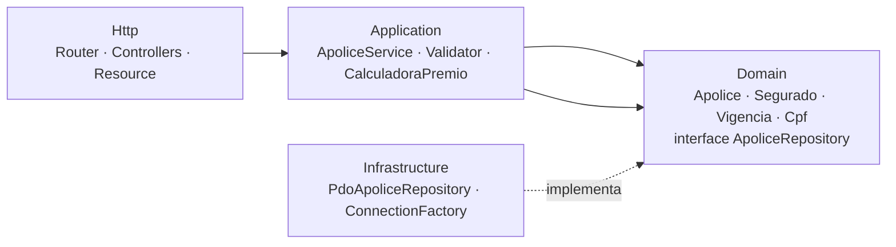

# Seguro Viagem · Gestão de Apólices

Aplicação para emissão e gestão de apólices de seguro viagem, desenvolvida para o desafio técnico da vaga de Analista Desenvolvedor Pleno.

Permite **cadastrar, consultar, editar e excluir** apólices. O valor do prêmio é calculado automaticamente a partir do plano, destino, quantidade de dias e idade do segurado.

| Camada | Tecnologia |
|---|---|
| Frontend | React 18 + Vite + React Router |
| Backend | PHP 8.3 (sem framework), arquitetura em camadas, PSR-4 / Composer |
| Banco de dados | MySQL 8 (Azure Database for MySQL). SQLite para rodar localmente sem instalar nada |
| Testes | PHPUnit (unidade + API) |
| Infra | Azure App Service, Static Web Apps, MySQL Flexible Server, Key Vault, Application Insights, Bicep, GitHub Actions |

---

## Desenho da solução


- **Static Web Apps** hospeda o React (arquivos estáticos em CDN, HTTPS e plano gratuito).
- **App Service (Linux, PHP 8.3)** executa a API REST.
- **Azure Database for MySQL Flexible Server** armazena as apólices, com backup automático e conexão TLS.
- **Key Vault** guarda a senha do banco. A API lê o segredo usando **Managed Identity**, então não existe credencial no código nem no repositório.
- **Application Insights** centraliza logs, falhas e tempo de resposta.
- **GitHub Actions** roda os testes a cada push e publica o frontend e a API.

Toda a infraestrutura está descrita em [`infra/main.bicep`](infra/main.bicep).

### Camadas do backend



A dependência sempre aponta para o **domínio**. O domínio não conhece banco, HTTP nem framework.

| Pasta | Responsabilidade |
|---|---|
| `src/Domain` | Regras de negócio: entidade `Apolice`, value objects (`Cpf`, `Vigencia`, `Segurado`), enums e o contrato `ApoliceRepository` |
| `src/Application` | Casos de uso (`ApoliceService`), validação de entrada e cálculo do prêmio |
| `src/Infrastructure` | Implementação com PDO (MySQL/SQLite), conexão, migrations e leitura do `.env` |
| `src/Http` | Roteamento, controllers, formatação da resposta JSON e tratamento centralizado de erros |
| `src/Container.php` | Composição das dependências (injeção de dependência manual) |

### SOLID na prática

| Princípio | Onde aparece |
|---|---|
| **S**ingle Responsibility | Cada classe tem um motivo para mudar: `ApoliceValidator` valida, `CalculadoraPremioViagem` calcula, `PdoApoliceRepository` persiste, `ApoliceController` traduz HTTP e `Kernel` trata erros/CORS |
| **O**pen/Closed | Novo plano ou destino = novo `case` no enum com seus fatores, sem alterar o serviço. Nova regra de preço = nova implementação de `CalculadoraPremio` |
| **L**iskov Substitution | Qualquer implementação de `ApoliceRepository` (PDO, memória) ou de `CalculadoraPremio` pode substituir a outra sem quebrar o serviço |
| **I**nterface Segregation | Interfaces pequenas e específicas: `ApoliceRepository`, `CalculadoraPremio`, `GeradorNumeroApolice` |
| **D**ependency Inversion | `ApoliceService` depende de interfaces, recebidas no construtor. Quem decide a implementação é o `Container` |

---

## Regras de negócio

- CPF validado pelos dígitos verificadores. É armazenado só com números e exibido com máscara.
- A vigência não pode terminar antes de começar e tem no máximo 365 dias.
- O número da apólice é gerado automaticamente (`CRS-2026-XXXXXXXX`).
- Uma apólice cancelada só pode ser alterada para ser reativada.
- **Prêmio** = `diária do plano × dias × fator do destino × fator de idade`

| Plano | Diária | Cobertura médica |
|---|---|---|
| Essencial | R$ 12,90 | R$ 30.000 |
| Plus | R$ 24,90 | R$ 60.000 |
| Premium | R$ 39,90 | R$ 150.000 |

Fator do destino: Nacional 0,5 · América do Sul 1,0 · Europa 1,3 · América do Norte 1,4 · Ásia/África/Oceania 1,5
Fator de idade: até 59 anos 1,0 · 60 a 74 anos 1,6 · 75+ anos 2,5

---

## API

| Método | Rota | Descrição |
|---|---|---|
| GET | `/api/apolices?busca=&status=` | Lista com busca (nome, CPF, e-mail, número) e filtro por status |
| GET | `/api/apolices/{id}` | Detalhe da apólice |
| POST | `/api/apolices` | Emite uma apólice (`201`) |
| PUT | `/api/apolices/{id}` | Atualiza a apólice e recalcula o prêmio |
| DELETE | `/api/apolices/{id}` | Exclui a apólice (`204`) |
| POST | `/api/apolices/cotacao` | Simula o prêmio sem salvar |
| GET | `/api/opcoes` | Planos, destinos e status disponíveis |
| GET | `/api/health` | Health check |

Erros seguem um formato único: `422` para validação (com erro por campo), `404` para não encontrado e `400` para JSON inválido.

```json
{
  "message": "Os dados informados são inválidos.",
  "errors": { "seguradoCpf": "CPF inválido." }
}
```

---

## Como executar

### Opção 1: Docker (recomendado)

```bash
docker compose up -d --build
docker compose exec api php bin/seed.php   # opcional: dados de exemplo
```

- Frontend: http://localhost:3000
- API: http://localhost:8000/api/apolices
- MySQL: `localhost:3306` (usuário `coris` / senha `coris123`)

### Opção 2: sem Docker (PHP 8.2+ e Node 18+)

```bash
# API (usa SQLite, não precisa instalar banco)
cd backend
composer install
cp .env.example .env
php bin/migrate.php
php bin/seed.php
php -S localhost:8000 -t public
```

```bash
# Frontend (em outro terminal)
cd frontend
npm install
npm run dev
```

Acesse http://localhost:5173

### Testes

```bash
cd backend
vendor/bin/phpunit
```

---

## Deploy na Azure

```bash
az login
az group create --name rg-coris-seguros --location brazilsouth

export MYSQL_ADMIN_PASSWORD='<senha-forte>'
az deployment group create \
  --resource-group rg-coris-seguros \
  --parameters infra/main.bicepparam
```

O comando exibe `apiUrl`, `apiName`, `frontendUrl` e `staticWebAppName`. Para o GitHub Actions publicar automaticamente, configure no repositório (**Settings → Secrets and variables → Actions**):

| Tipo | Nome | Valor |
|---|---|---|
| Variable | `AZURE_WEBAPP_NAME` | `apiName` |
| Variable | `AZURE_API_URL` | `apiUrl` |
| Secret | `AZURE_WEBAPP_PUBLISH_PROFILE` | Portal → App Service → *Download publish profile* |
| Secret | `AZURE_STATIC_WEB_APPS_API_TOKEN` | Portal → Static Web App → *Manage deployment token* |

Para remover tudo e parar a cobrança: `az group delete --name rg-coris-seguros`.

---

## Estrutura

```
├── backend
│   ├── bin/                 migrate e seed
│   ├── database/schema/     SQL para MySQL e SQLite
│   ├── public/index.php     front controller
│   ├── src/
│   │   ├── Domain/
│   │   ├── Application/
│   │   ├── Infrastructure/
│   │   └── Http/
│   └── tests/               Unit e Feature
├── frontend
│   └── src/
│       ├── api/             cliente HTTP
│       ├── components/
│       ├── hooks/
│       ├── pages/           lista, cadastro, edição e detalhe
│       └── utils/
├── infra/main.bicep         infraestrutura como código
├── docs/                    desenho da solução
└── docker-compose.yml
```
