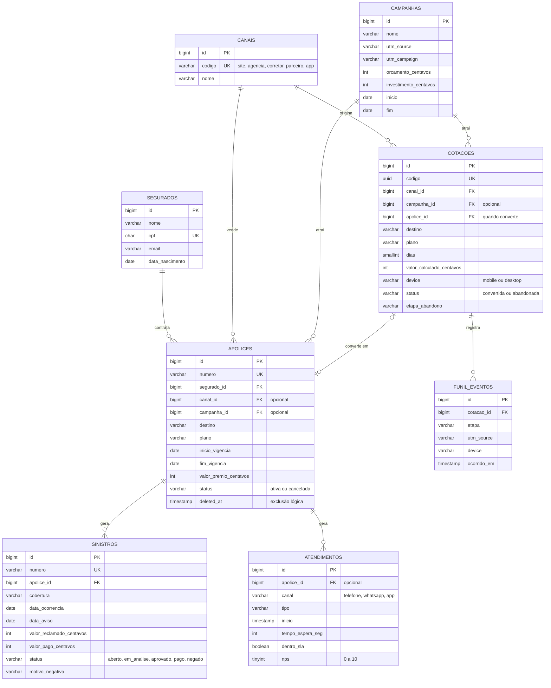

# Modelo de dados

As tabelas `segurados` e `apolices` são o cadastro principal (CRUD). As demais guardam os dados usados pela dashboard.

## Decisões

- **Valores em centavos (inteiro)** em todas as tabelas, como na apólice, para não ter erro de arredondamento.
- **Migrations novas** (`2026_09_24_*`): as tabelas antigas não foram editadas; `canal_id` e `campanha_id` entraram na apólice por uma migration de alteração e são opcionais, então as apólices cadastradas pela tela continuam funcionando.
- **Índices** nas colunas usadas pelos filtros da dashboard: `apolices.created_at`, `cotacoes (created_at, status)`, `funil_eventos (cotacao_id, etapa)`, `sinistros (status, data_aviso)` e `atendimentos.inicio`.
